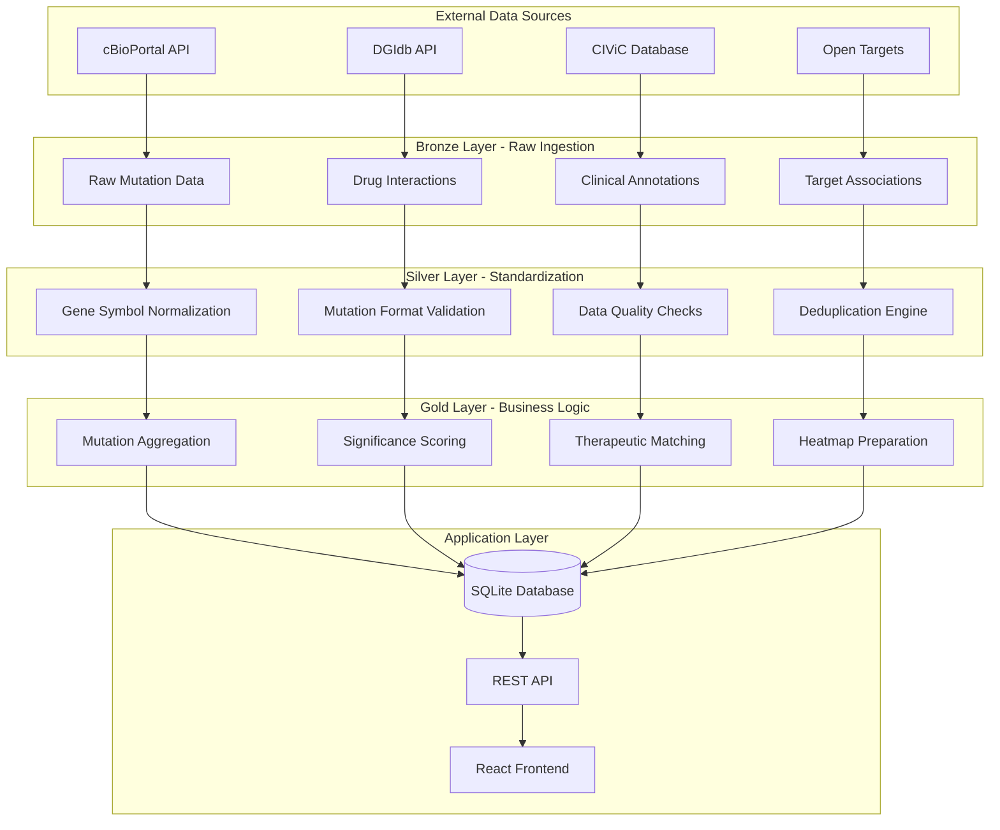
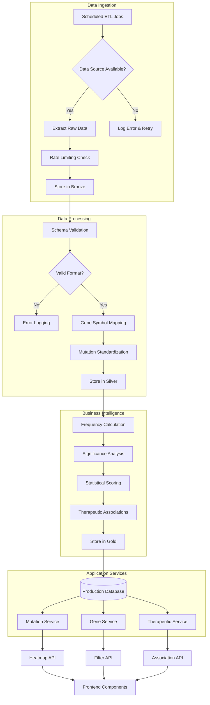
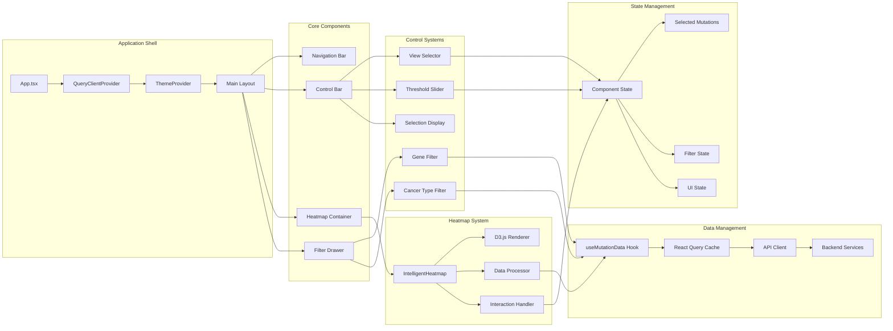
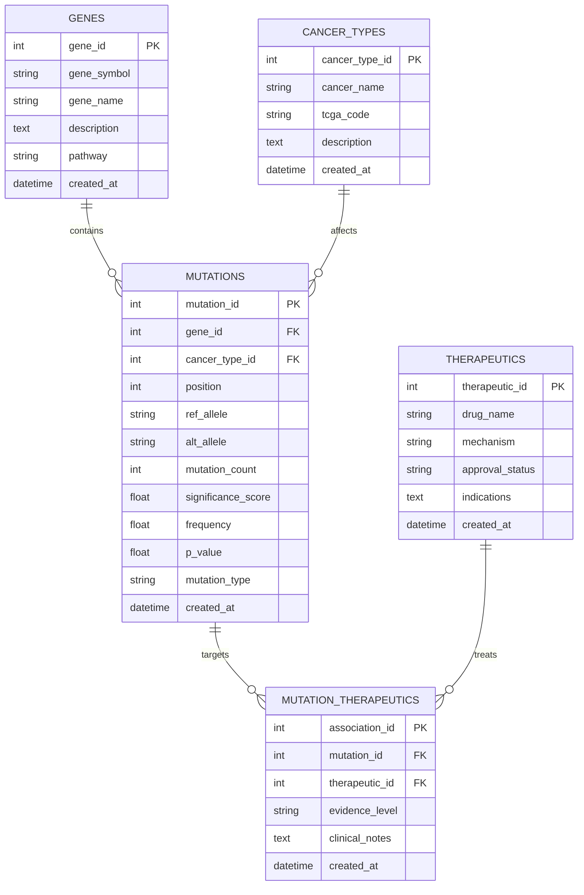
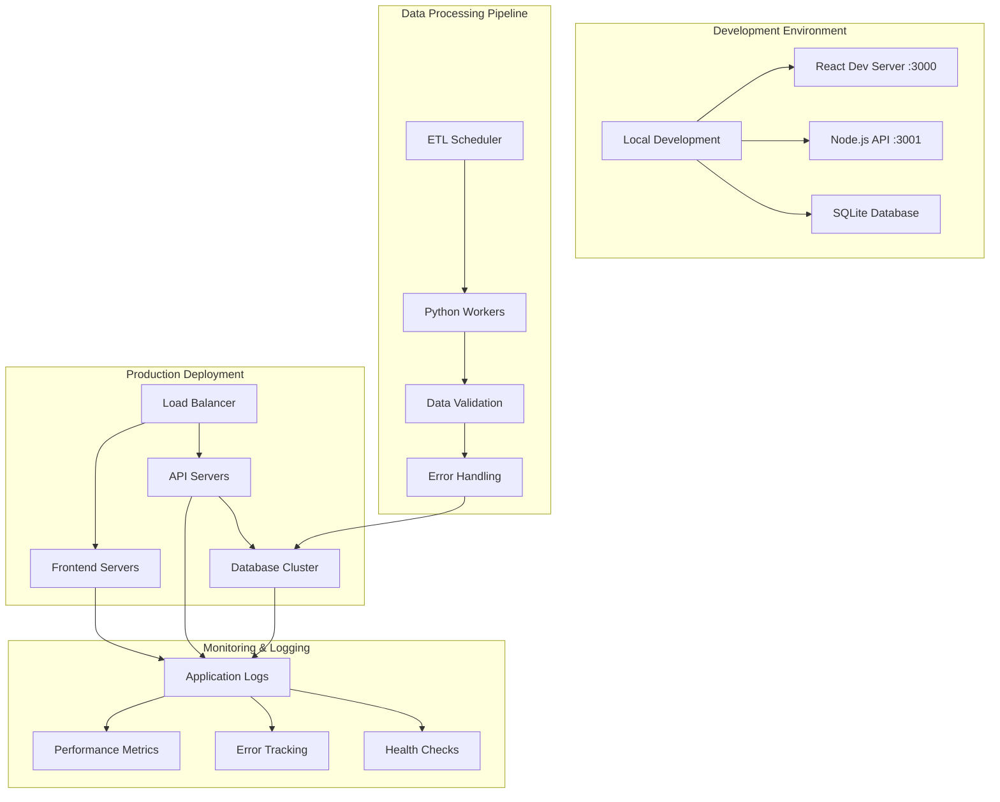
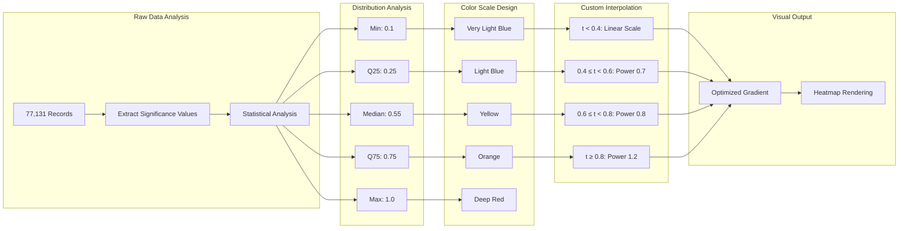

# OncoHotspot Architecture Diagrams

## ETL Pipeline - Medallion Architecture

## Data Flow Architecture

## Frontend Component Architecture

## Database Schema Relationships

## System Deployment Architecture

## Data Significance Analysis Pipeline

